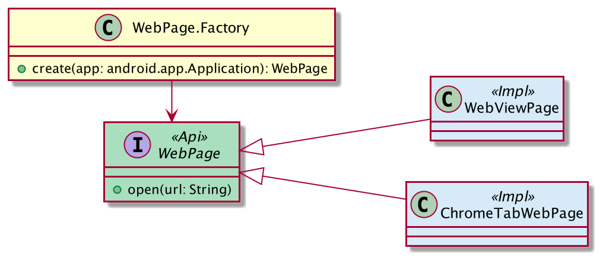

# Reddit Client Demo App

## CI
The following projects relies on [Github Actions](https://github.com/features/actions).
As part of each new pull request we do execute `./gradlew check` and build debug version of application.

You can find the latest version inside [Actions Tab](https://github.com/tomkoptel/sliide-task/actions).

# App

# Architecture

According to the state diagram application relies on [the clean architecture](https://www.freecodecamp.org/news/a-quick-introduction-to-clean-architecture-990c014448d2/).

The app relies on the vertical organisation of the source code.
The vertical organisation reflected on the package structure that follows:

- $companyPackage.feature.X.data (holds impl of use cases + schema used to pull data)
- $companyPackage.feature.X.domain (represents plain old Kotlin objects and pure interfaces)
- $companyPackage.feature.X.ui (represents UI layer)
- $companyPackage.lib.Y (represents additional capability used to extend functionality e.g. caching)

The app packages:

- $companyPackage.feature.feed (implementation of Reddit list of Hot feeds)
- $companyPackage.feature.web (implementation of web navigation)
- $companyPackage.lib.okhhtp (utilities used to implement file based caching)

The web navigation build on the basis of [Custom Chrome Tabs](https://developer.chrome.com/docs/android/custom-tabs/overview/).
Custom Chrome Tabs library allows us to keep immersive experience without forcing out the user to
the mobile browse when we display web page.
The solution build in mind with the fallback strategy if the Custom Chrome Tabs not supported on device (e.g Chinese market).
The organisation of classes described on the following diagram.

We do rely on the Factory pattern to pick the supported implementation of `WebPage` interfaces during the injection phase.
The `WebPage` API scoped to Activity lifecycle, so we do receive for every new instance of Activity new instance of the implementation.

# Libraries
Networking stack
- [Moshi](https://github.com/square/moshi)
- [OkHttp](https://square.github.io/okhttp/)
- [Retrofit](https://square.github.io/retrofit/)

UI stack
- [Jetpack Compose](https://developer.android.com/jetpack/compose)
- [Compose Paging](https://developer.android.com/jetpack/androidx/releases/paging)
- [Custom Chrome Tabs](https://developer.chrome.com/docs/android/custom-tabs/overview/)

Miscellaneous:
- [Dagger Hilt](https://dagger.dev/hilt/)
- [Kotlin Coroutines](https://developer.android.com/kotlin/coroutines)

Unit Testing
- [Mockk](https://github.com/mockk/mockk)
- [Junit 4](https://junit.org/junit4/)
- [Kluent](https://github.com/MarkusAmshove/Kluent)

# Dev Tools
- Android Studio Arctic Fox | 2020.3.1 Beta 3 (Build #AI-203.7717.56.2031.7395685, built on May 25, 2021)
- [Kotlin 1.4.32](https://github.com/JetBrains/kotlin/releases/tag/v1.4.31)
- [Android Gradle Plugin 7.0.0-beta03](https://developer.android.com/studio/releases/gradle-plugin)
- [Gradle 7.0.2](https://gradle.org/releases/)
